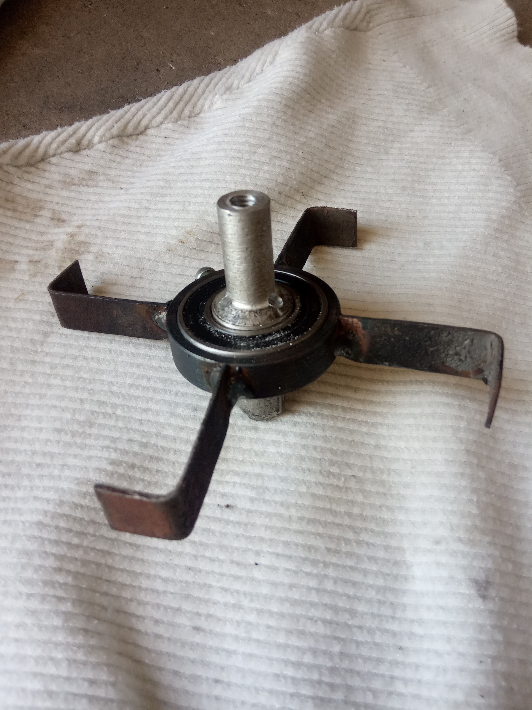
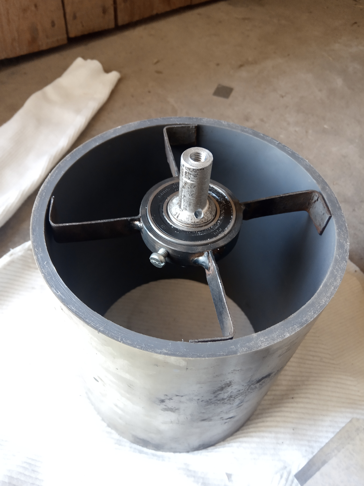
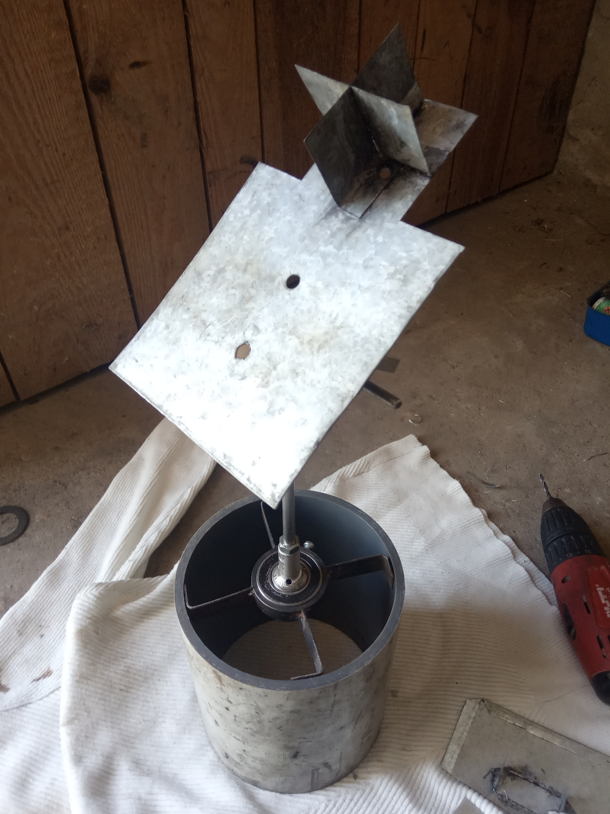
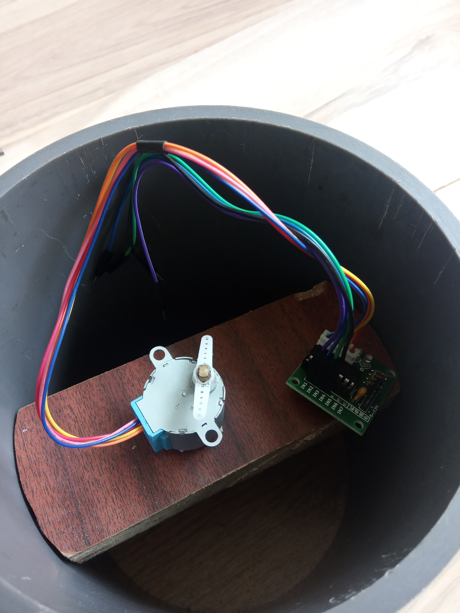

# PhotovoltaicSystem

WORK IN PROGRESS

Engineering work entitled "A solar system following the sun"
This is a repository for files associated with my engineering work. This repository contain arduino program, photos and word document.

Demonstration of action (timelapse):

https://user-images.githubusercontent.com/92920833/138950048-f2738cb1-5066-4342-91d9-b7f5de5a17e9.mp4

Subsequent stages of construction:

  

  
